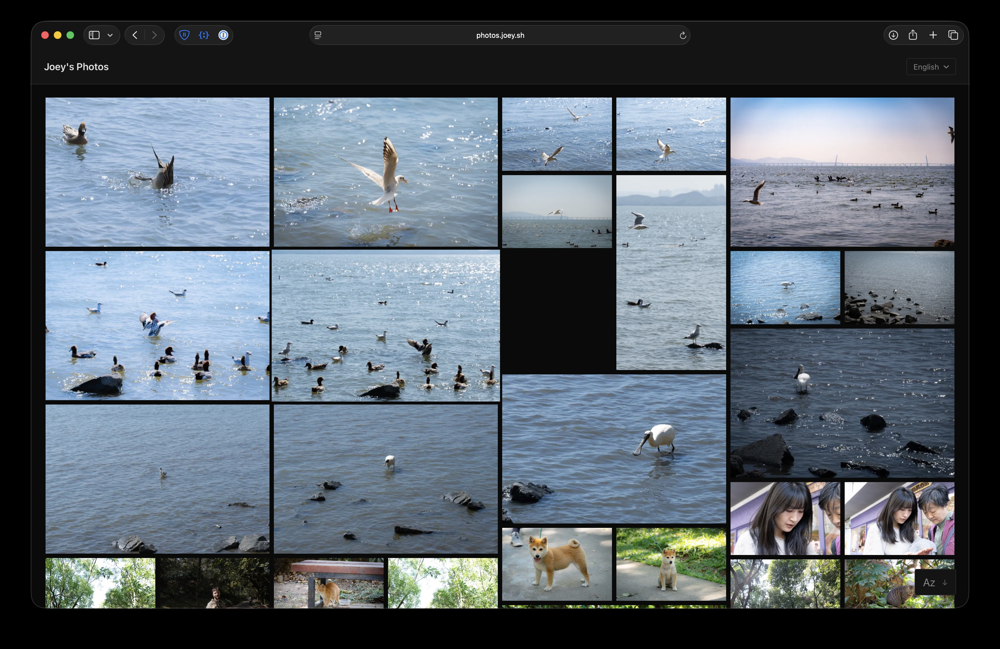

# galerie

A fast, minimal static site generator for photo galleries.



## Why galerie?

- **Just add photos** - Point it at a folder of images and get a complete website
- **Beautiful defaults** - Ships with the "fancy" theme: masonry grid, keyboard navigation, EXIF display, maps, 20 languages
- **Privacy-first GPS** - Strip exact coordinates while keeping city/country, or remove location data entirely
- **Fast** - Parallel processing, incremental builds, content-addressed caching
- **Truly static** - Output is plain HTML/CSS/JS. Host anywhere: S3, nginx, GitHub Pages, a Raspberry Pi

## Quick Start

### 1. Install

Download the latest binary for your platform from the [releases page](https://github.com/Twister915/galerie/releases):

| Platform | Binary |
|----------|--------|
| macOS (Apple Silicon) | `galerie-macos-arm64` |
| Linux (x86_64) | `galerie-linux-x86_64` |
| Linux (ARM64) | `galerie-linux-arm64` |
| Windows | `galerie-windows-x86_64.exe` |

```bash
# Example for Linux x86_64
curl -L -o galerie https://github.com/Twister915/galerie/releases/latest/download/galerie-linux-x86_64
chmod +x galerie
sudo mv galerie /usr/local/bin/
```

See the [Installation Guide](wiki/install.md) for building from source and troubleshooting.

### 2. Create a Gallery

```
my-gallery/
├── site.toml
└── photos/
    ├── landscape.jpg
    ├── portrait.jpg
    └── vacation/
        ├── day1.jpg
        └── day2.jpg
```

Minimal `site.toml`:

```toml
domain = "photos.example.com"
```

### 3. Build and Preview

```bash
galerie -C my-gallery serve
```

Open http://localhost:3000 to view your gallery.

## Features

| Feature | Description |
|---------|-------------|
| Image optimization | WebP thumbnails (600px) and full-size (2400px) from JPEG/PNG/WebP/GIF |
| EXIF extraction | Date, camera, lens, GPS, exposure settings pulled from photos |
| Hierarchical albums | Directory structure becomes album hierarchy |
| Incremental builds | BLAKE3 content hashing - only regenerates changed images |
| Asset minification | HTML, CSS, JavaScript minified by default |
| Cache-busting | Content-hashed filenames for optimal browser caching |
| 20 languages | Client-side language switching with auto-detection |
| Development server | Built-in HTTP server for local preview |

## GPS Privacy

Control location data with the `gps` setting:

| Mode | Shows Coordinates | Shows City/Country | GPS in Downloads |
|------|-------------------|-------------------|------------------|
| `on` | Yes | Yes | Preserved |
| `general` | No | Yes | Stripped |
| `off` | No | No | Stripped |

```toml
gps = "general"  # Hide exact location, keep city/country
```

## Configuration

```toml
domain = "photos.example.com"     # Required
title = "My Photo Gallery"        # Optional (defaults to domain)
theme = "fancy"                   # "basic", "fancy", or path to custom theme
photos = "albums"                 # Source directory (default: "photos")
build = "public"                  # Output directory (default: "dist")
all_languages = true              # Enable all 20 languages
```

See [Site Configuration](wiki/site-config.md) for all options.

## Commands

```bash
galerie -C path/to/site build      # Build the site
galerie -C path/to/site serve      # Build and serve locally
galerie -C path/to/site clean      # Delete output directory
galerie -C path/to/site -v build   # Verbose logging
```

## Documentation

- [Installation](wiki/install.md) - Prerequisites, building from source, troubleshooting
- [Site Configuration](wiki/site-config.md) - All `site.toml` options
- [Image Processing](wiki/image-processing.md) - How images are optimized and cached
- [Internationalization](wiki/i18n.md) - 20 languages, translation keys, theme integration
- [Theme Structure](wiki/theme-structure.md) - Creating custom themes (classic and Vite-based)
- [Templates](wiki/templates.md) - Template files and behavior
- [Template Context](wiki/template-context.md) - Variables available in templates
- [Hosting](wiki/hosting.md) - Deploy to S3, GCS, nginx, Cloudflare
- [Raspberry Pi Setup](wiki/raspberry-pi-setup.md) - Auto-rebuild server with systemd

## Built-in Themes

**fancy** (default): Dark mode, masonry grid, photo viewer with keyboard navigation, EXIF info drawer, slideshow mode, OpenStreetMap integration, touch gestures, 20 languages.

**basic**: Minimal, clean layout. Good starting point for custom themes.

## License

MIT
